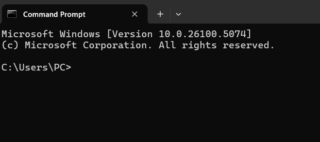

In this tutorial, we will take Auburn university remote computers as an example. The aim of accessing that computer is to get more resources such as GPU and more RAM.

I am going to  guide you step-by-step.

### 1. Get credentials
Your first job will be to  email the admin or system engineer of the organization and request him to setup your system and provide you the credentials such as email and password.

### 2. Accessing the system
Now, as you have your credentials with you, open the command prompt using windows key+ R and then typing cmd into text box.
It will look something like this

